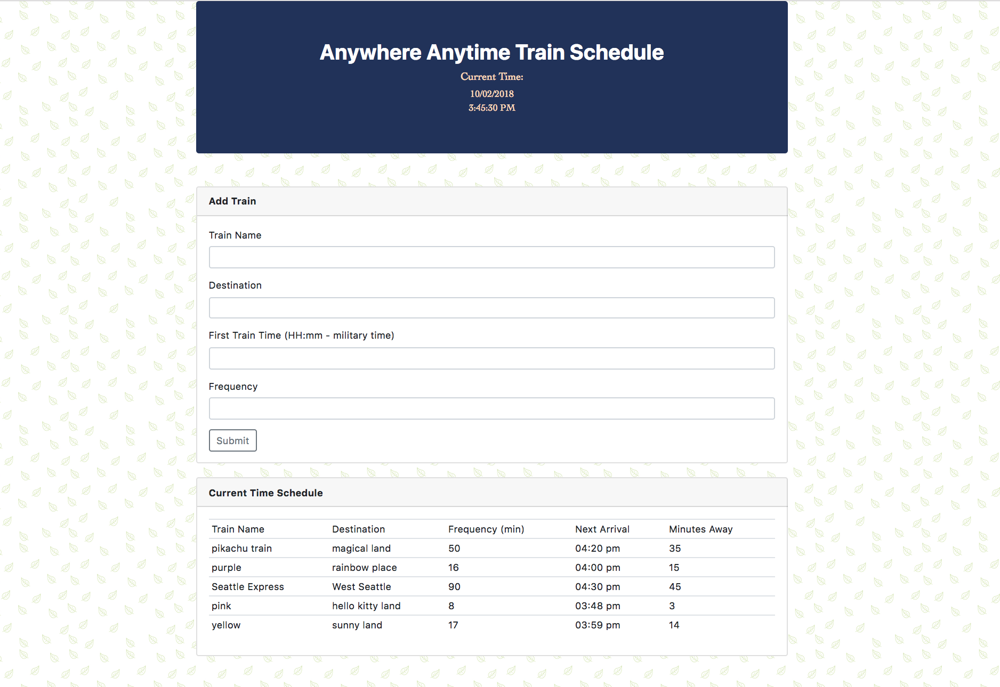

# TrainScheduler

## Table of Contents 
1. [Overview](#overview)
2. [Technologies](#technologies)
3. [Local Installation](#installation)
4. [App Display](#display)

## Overview

Create a train schedule application that incorporates Firebase to host arrival and departure data, retrieving and manipulating this information with Moment.js.

## Technologies
* HTML
* CSS
* JavaScript:  setTimeout; setInterval
* jQuery
* Moment.js
* Firebase

## Installation

Download the files to your computer from https://github.com/hyxhuynh/TrainScheduler and open index.html using your browser (eg. Google Chrome)

Or visit: https://hyxhuynh.github.io/TrainScheduler/

## App Display

